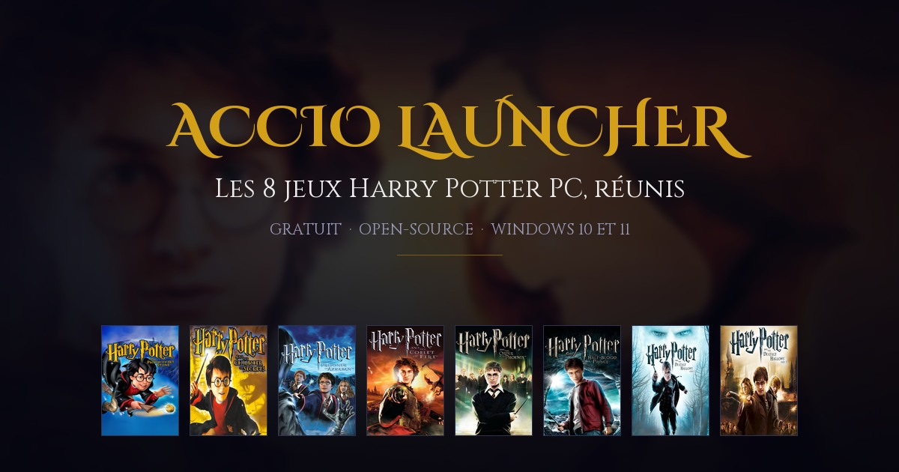
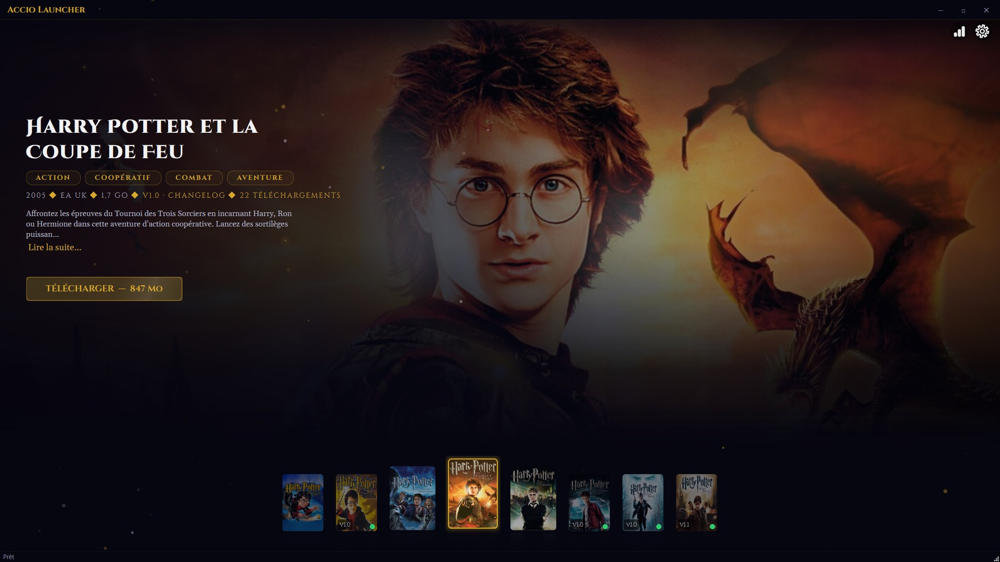
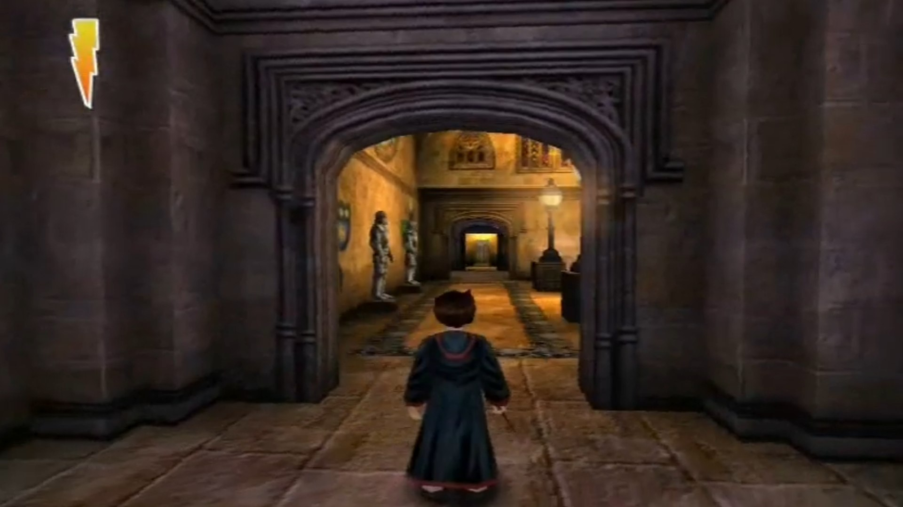
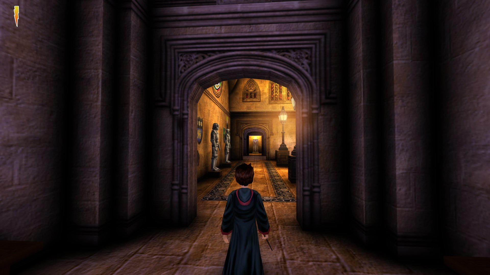

# Accio Launcher — le site

Le dépôt de la page d'accueil d'**Accio Launcher**, le launcher qui réunit les
8 jeux Harry Potter PC (2001–2011).

**→ [acciolauncher.be](https://acciolauncher.be/)**

## Le reste du projet

- **[Le launcher](https://github.com/ludvdber/AccioLauncher)** — l'application, les versions, les tickets
- **[Le catalogue des jeux](https://github.com/ludvdber/accio-launcher-games)** — ce que le launcher installe
- **[Le Discord](https://discord.gg/TNwDQd7KGe)** — questions, captures, entraide

Un bug, une idée ? [Ouvre un ticket](https://github.com/ludvdber/AccioLauncher/issues).

## Aperçu

Le launcher :

Ce que les améliorations graphiques donnent, sur un couloir de Poudlard :

|                               Avant                                |                               Après                               |
|:----------------------------------------------------------------:|:---------------------------------------------------------------:|
|  |  |

## Licence

**Tous droits réservés.** Ce site est un travail personnel : son code, ses textes et sa
mise en page ne sont pas réutilisables sans mon accord écrit. Voir [LICENSE](LICENSE).

## Mentions

Projet communautaire indépendant, non affilié à Warner Bros. Entertainment Inc. ni à
Electronic Arts Inc. Les jaquettes et visuels des jeux appartiennent à leurs ayants
droit. Harry Potter™ est une marque déposée de Warner Bros. Entertainment Inc.
